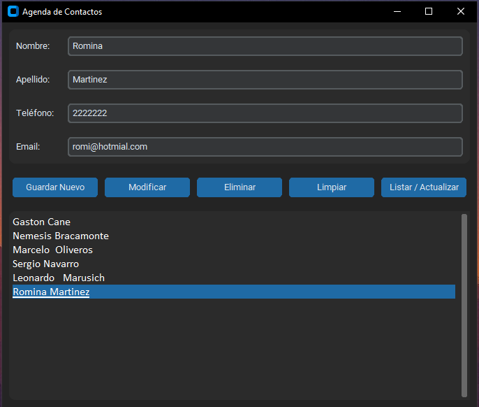

# 📘 Agenda de Contactos - Gestión Inteligente con Python


> Una aplicación de escritorio moderna y robusta para la gestión de contactos (ABM), diseñada con una arquitectura modular y principios de Programación Orientada a Objetos (POO).

---

## 🖼️ Vista Previa




---

## 🚀 Descripción del Proyecto

[cite_start]Este sistema permite administrar una libreta de contactos personal de manera intuitiva y segura[cite: 4, 6]. [cite_start]A diferencia de scripts básicos, este proyecto implementa una **arquitectura de software profesional** que separa la lógica de negocio de la interfaz gráfica[cite: 8].

[cite_start]El objetivo principal es proveer una herramienta intuitiva para realizar operaciones CRUD (Alta, Baja y Modificación), garantizando la integridad de los datos mediante validaciones lógicas y SQL[cite: 6, 30].

### ✨ Características Principales

* [cite_start]**Gestión Completa (CRUD):** Funcionalidades de agregar, leer, modificar y eliminar contactos de forma persistente[cite: 6].
* [cite_start]**Interfaz Moderna:** Uso de `customtkinter` para lograr una estética visual superior con bordes redondeados y temas integrados[cite: 5, 44].
* **Validación Inteligente:**
    * Campos obligatorios protegidos.
    * [cite_start]**Prevención de duplicados:** El sistema verifica si un contacto ya existe (insensible a mayúsculas/minúsculas mediante `LOWER()` en SQL) antes de guardarlo[cite: 37].
* [cite_start]**Seguridad:** Implementación de consultas SQL parametrizadas para blindar la aplicación contra inyecciones SQL.
* [cite_start]**Arquitectura Escalable:** Diseño modular que facilita el mantenimiento y futuras expansiones[cite: 14, 63].

---

## 🏗️ Arquitectura del Software

[cite_start]El proyecto sigue estrictamente el principio de **Separación de Responsabilidades**, dividiendo el código en capas lógicas[cite: 7, 8]:

### 1. Capa de Vista (`main.py`) 🖥️
* **Responsabilidad:** Es la "cara" de la aplicación. [cite_start]Gestiona la presentación visual y captura los eventos del usuario[cite: 11, 13].
* **Detalle:** Actúa como controlador pero es completamente independiente de la lógica de datos. [cite_start]Nunca ejecuta SQL directamente[cite: 47].

### 2. Capa de Modelo (`modelo.py`) 🧠
* [cite_start]**Responsabilidad:** Es el "cerebro" y encapsula la lógica de negocio y el acceso a datos[cite: 9, 10].
* **Componentes:**
    * [cite_start]**Clase `Contacto`:** Blueprint que define la estructura de datos de la entidad principal[cite: 20].
    * [cite_start]**Clase `AdministradorDB`:** Actúa como un DAO (Data Access Object), centralizando la conexión y todas las sentencias DDL y DML[cite: 26, 30].

---

## 🛠️ Tecnologías Utilizadas

| Tecnología | Uso en el proyecto |
| :--- | :--- |
| **Python** | Lenguaje principal del backend y frontend. |
| **SQLite3** | [cite_start]Motor de base de datos relacional ligero y eficiente[cite: 5]. |
| **CustomTkinter** | [cite_start]Librería gráfica para interfaces modernas (wrapper de Tkinter)[cite: 5]. |
| **POO** | [cite_start]Paradigma utilizado para estructurar el código (Clases y Objetos)[cite: 5]. |

---

## 📂 Estructura del Proyecto

```text
📁 Agenda-Contactos
│
├── main.py           # Frontend: Interfaz Gráfica y Control de Eventos [cite: 11]
├── modelo.py         # Backend: Lógica de Negocio y DAO [cite: 9]
├── agenda.db         # Persistencia: Base de datos SQLite (Auto-generada) [cite: 57]
└── Documentacion.pdf # Documentación técnica detallada del sistema
